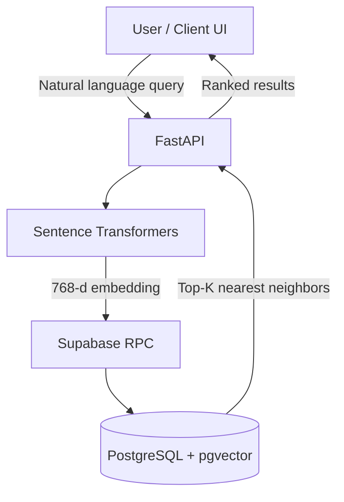

<div align="center">

# Tourism Together — AI Service

**Semantic search & personalized recommendations for an AI-powered travel planning platform.**

[](https://www.python.org/)
[](https://fastapi.tiangolo.com/)
[](https://www.postgresql.org/)
[](https://github.com/TourismTogether)

[Live Demo](https://tourism-together.vercel.app) · [Organization](https://github.com/TourismTogether)

</div>

---

## 📌 Overview

**Tourism Together** is the retrieval layer of an AI-powered travel platform. It turns natural-language queries into dense vectors and runs **top‑K similarity search** inside **PostgreSQL (pgvector)**—so users find destinations, trips, and routes by *meaning*, not just keywords.

Traditional travel search breaks when intent is fuzzy or multilingual. This service uses **semantic understanding** to match emotional, long-form, or mixed-language queries to the right content.

The screenshots below show the **Tourism Together** client experience powered by this service's search and recommendation APIs.

---

## 📸 Screenshots

<div align="center">

**Semantic search** — natural-language queries over destinations (vector-backed retrieval)


<br /><br />

**Personalized recommendations** — destination suggestions from user context


<br /><br />

**Trips & destinations** — recommended trips alongside destinations


</div>

---

## 🎯 Problem → Solution

| Challenge | How this service addresses it |
|-----------|--------------------------------|
| Keyword-only search misses intent | **Semantic embeddings** capture query meaning |
| Irrelevant or empty results | **Vector similarity** ranks by relevance |
| Shipping huge embedding payloads to the client | **Supabase RPC + pgvector** keeps vectors on the server |

---

## ✨ Key Features

- **Multilingual semantic search** — Vietnamese & English via [`paraphrase-multilingual-mpnet-base-v2`](https://huggingface.co/sentence-transformers/paraphrase-multilingual-mpnet-base-v2) (768-dim embeddings).
- **Personalized recommendations** — User context (e.g. reviews, trip history) is encoded and matched against the same vector index.
- **Optimized vector retrieval** — Indexed **pgvector** queries through **Supabase RPC**; no full-table embedding transfer per request.

---

## 🏗️ Architecture



**Flow:** User query → FastAPI → encode with Sentence Transformers → vector → **single RPC** → pgvector similarity → **Top‑K** → JSON response to the client.

---

## 🛠️ Tech Stack

| Layer | Technologies |
|-------|----------------|
| **API** | FastAPI, Uvicorn |
| **AI / ML** | Sentence-Transformers, PyTorch (backend), NumPy |
| **Data** | Supabase client, PostgreSQL **pgvector** extension |
| **Ops** | Environment-based config; deployable as a containerized Python service |

---

## ⚡ Performance

**Why RPC wins:** A naive approach fetches *all* destination embeddings to the application layer every time—massive **data overhead** and latency. **pgvector RPC** runs similarity **inside the database**, returning only **Top‑K** rows and metadata.

### Benchmark (representative run)

| Method | Median latency | Data overhead | Scalability |
|--------|----------------|---------------|-------------|
| **Naive client-side / full fetch + scan** | ~2830 ms | High (full embedding set) | Poor |
| **pgvector RPC (this service)** | ~87 ms | Minimal (Top‑K only) | High |

**Impact:** ~**32×** faster median latency vs. the naive path, by eliminating bulk embedding transfer and pushing retrieval to the database.

> Reproduce or tune numbers locally: `python scripts/benchmark_retrieval.py --iterations 50 --top-k 16`

---

## 🚀 Getting Started

### Prerequisites

- **Python 3.10+**
- **Supabase** project with **pgvector** enabled and RPC functions applied (see `migrations/`)
- **Environment variables:** `SUPABASE_URL`, `SUPABASE_KEY` (service role for batch jobs; never expose in browsers)

### Installation

```bash
git clone https://github.com/TourismTogether/Tourism.git
cd Tourism/ai-service
```

```bash
python -m venv .venv
# Windows: .venv\Scripts\activate
# macOS/Linux: source .venv/bin/activate
pip install -r requirements.txt
```

### Configuration

Create `.env` in `ai-service/`:

```env
SUPABASE_URL=https://your-project.supabase.co
SUPABASE_KEY=your-service-role-or-anon-key
CORS_ORIGINS=*
```

### Run the server

```bash
uvicorn app.main:app --reload --host 0.0.0.0 --port 8000
```

- **Health:** `GET /health`
- **Search:** `GET /search/destinations?query=...&top_k=5`
- **Recommend:** `GET /recommend/destinations?user_id=...&top_k=5`

### Embeddings (one-time / refresh)

```bash
python scripts/build_embeddings.py
```

---

## 👥 Contributors

| Name | Role |
|------|------|
| **Bui Nam Viet** | AI Engineer |

---

## 📜 License

See the repository root for license terms.
